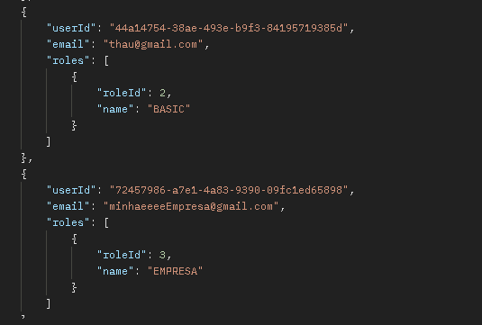
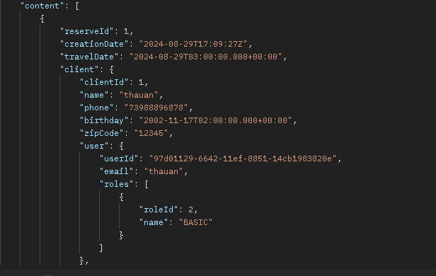
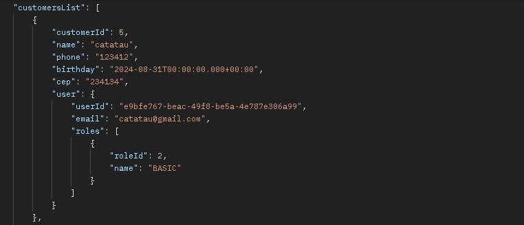
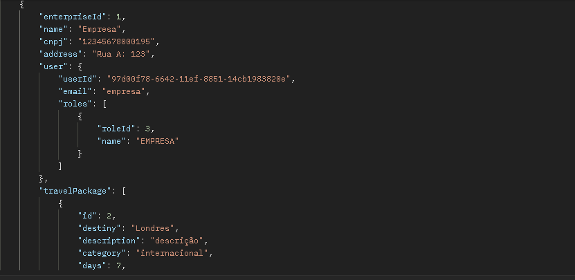
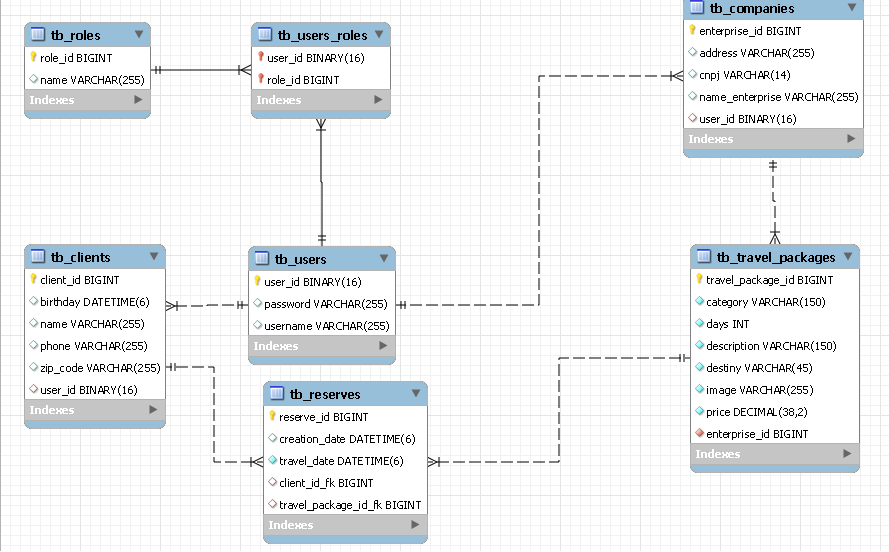

# 
Tropical Agência de viagens

## Autor 
https://www.linkedin.com/in/thauan-devjr/

## Descrição 

### Este projeto foi desenvolvido com fins didáticos, abordando tanto o Front End quanto o Back End. Foi implementada autenticação e autorização de usuários, assegurando que cada tipo de usuário tenha um papel específico. Além disso, utilizei o RabbitMQ para mensageria assíncrona, e, sempre que um novo cliente é cadastrado, ele recebe um e-mail de boas-vindas.

    
<b>Usuários</b>

    

    
<b>Pacotes de viagem</b>

    

    
<b>Reservas</b>

    

    
<b>Clientes</b>

    

    
<b>Empresas</b>

    

# Diagramas

    
<b>Diagrama de classes</b>

    
    
<b>Diagrama de classes Ms email</b>

    

    
<b>Diagrama de entidade e relacionamento</b>

    
    
<b>Diagrama de entidade e relacionamento Ms Email</b>

    

## Criação do banco de dados
### Antes de tudo, é necessario criar o banco de dados:

create database tropical;

create database email;

### Execute os projetos para criar as tabelas
### senha dos usuários: 123
## Documentação swagger
http://localhost/swagger-ui/index.html

### Docker images 
Front:

tropical api:

email ms:

